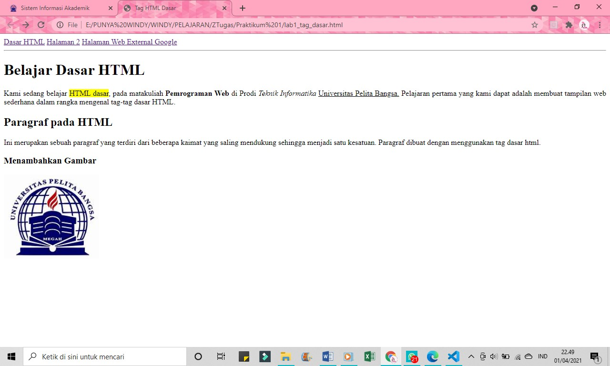

# Praktik1
## Belajar Tag Dasar HTML

### Menjawab Pertanyaan Tugas Praktik Satu
1. Lakukan perubahan pada kode sesuai dengan keinginan anda, amati perubahannya adakah 
error ketika terjadi kesalahan penulisan tag?
jawaban = Iya, ada.

2. Apa perbedaan dari tag 
 dengan tag  , berikan penjelasannya!
Jawaban = Tag '
' untuk membuat paragraf. Tag ' ' untuk berpindah ke baris selanjutnya.

3. Apa perbedaan atribut title dan alt pada tag , berikan penjelasannya!
Jawaban = atribut title untuk membuat judul gambar, sementara alt untuk membuat deskripsi gambar.

4. Untuk mengatur ukuran gambar, digunakan atribut width dan height. Agar tampilan gambar 
proporsional sebaiknya kedua atribut tersebut diisi semua atau tidak? Berikan penjelasannya!
Jawaban = Iya, karena untuk membuat gambar proporsional, maka sebaiknya menggunakan atribut width dan height.

5. Pada link tambahkan atribut target dengan nilai atribut bervariasi ( _blank, _self, _top, 
_parent ), apa yang terjadi pada masing-masing nilai antribut tersebut?
Jawaban = Maka link yang ditambahkan akan mengikuti instruksi dari atribut tersebut.

### Membuat Paragraf
Membuat HTML dasar

Ini adalah tampilannya

Membuat paragraf

Ini adalah tampilannya

Menampilakan gambar

Ini adalah tampilannya

Menampilkan link dokumen

Ini adalah tampilannya

